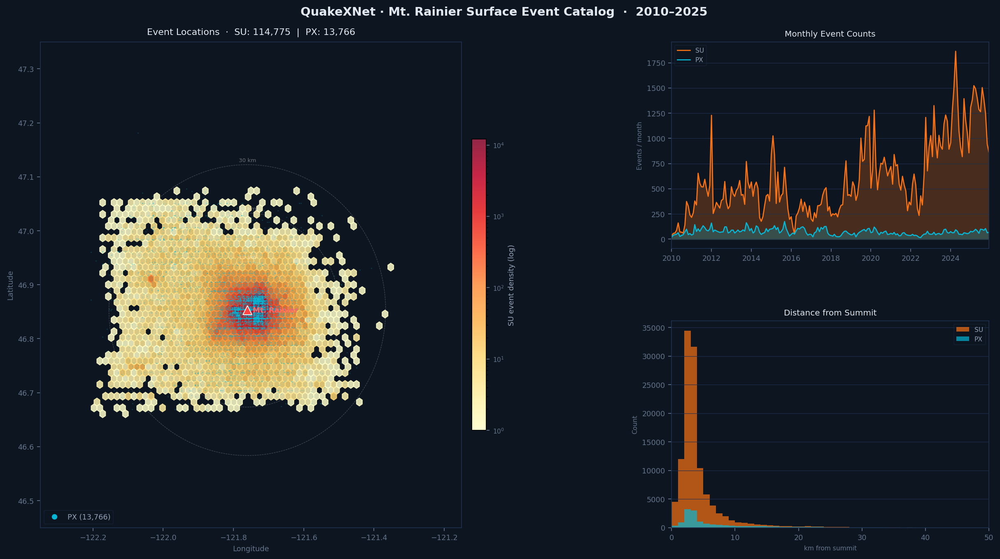

# QuakeXNet · Mt. Rainier Surface Event Catalog (2010–2025)

End-to-end pipeline for building a 15-year catalog of surface seismic events near Mt. Rainier. The workflow runs the **QuakeXNet** deep-learning detector on continuous waveforms from stations within 50 km of the volcano, aggregates detections across the network, locates them with **ENVELOC**, and validates the results against the PNSN and ESEC catalogs.

| | |
|---|---|
| **Surface events (SU)** | 114,775 |
| **Explosions (PX)** | 13,766 |
| **Total located** | 128,541 |
| **Period** | Jan 2010 – Dec 2025 |

## Catalog Overview



> **Interactive dashboard** – explore the full catalog at [**akashkharita.github.io/pnw_seismic_event_detection/data/enveloc_dashboard.html**](https://akashkharita.github.io/pnw_seismic_event_detection/data/enveloc_dashboard.html): heatmap / point-cloud toggle, time-series, distance histogram, and per-class / per-station-count filters.

---

## Repository Structure

```
src/          Detection and location scripts
notebooks/    Analysis, validation, and exploration notebooks
data/         Catalog outputs and dashboard
utils/        Station metadata
```

---

## Notebooks

### Detection & Pipeline

| Notebook | What it shows |
|---|---|
| [`plotting_commonly_detected_events.ipynb`](notebooks/plotting_commonly_detected_events.ipynb) | Gathers per-station daily detections, finds events seen at ≥ 4 stations, and plots waveforms + probability curves for network-level events |
| [`walking_through_generate_common_events.ipynb`](notebooks/walking_through_generate_common_events.ipynb) | Step-by-step walkthrough of the common-event aggregation logic (time-alignment, grouping, station-count filtering) |
| [`creating_station_json_file_for_the_detector.ipynb`](notebooks/creating_station_json_file_for_the_detector.ipynb) | Builds the `stations.json` configuration used by the detector |

### Location

| Notebook | What it shows |
|---|---|
| [`enveloc_location_for_detected_events.ipynb`](notebooks/enveloc_location_for_detected_events.ipynb) | Runs ENVELOC on network-level detections; benchmarks sequential vs. parallel waveform downloading |
| [`combining_all_the_locations_into_single_file.ipynb`](notebooks/combining_all_the_locations_into_single_file.ipynb) | Merges per-day ENVELOC outputs into the master catalog CSV |
| [`testing_location_using_enveloc.ipynb`](notebooks/testing_location_using_enveloc.ipynb) | Tests and tunes ENVELOC hyperparameters on a subset of events |

### Catalog Validation & Diagnostics

| Notebook | What it shows |
|---|---|
| [`quakexnet_diagnostic.ipynb`](notebooks/quakexnet_diagnostic.ipynb) | Comprehensive diagnostic: PNSN recall analysis, missed-event classification (confused / ambiguous / missed), single-event trace-through, co-association check, and V1 vs V3 catalog comparison |
| [`comparing_with_pnsn_catalog.ipynb`](notebooks/comparing_with_pnsn_catalog.ipynb) | Matches QuakeXNet detections to the PNSN catalog by distance and time tolerance; computes precision/recall |
| [`validating_enveloc_locations_for_esec_events.ipynb`](notebooks/validating_enveloc_locations_for_esec_events.ipynb) | Cross-checks located events against the ESEC documented surface-event catalog (quality score 1–5) |
| [`analyzing_quakexnet_15_years_detection_results.ipynb`](notebooks/analyzing_quakexnet_15_years_detection_results.ipynb) | Bulk analysis of the full 15-year detection run: class distributions, temporal trends, and PNSN comparison |

### Surface Event Characterization

| Notebook | What it shows |
|---|---|
| [`su_clustering_new_new.ipynb`](notebooks/su_clustering_new_new.ipynb) | Clusters surface events by source type using 128-dim QuakeXNet embeddings (best-window extraction → UMAP → HDBSCAN), with spectrogram visualization per cluster |
| [`single_event_analysis.ipynb`](notebooks/single_event_analysis.ipynb) | Deep-dive on a single icefall event: compares STA/LTA, deep-learning, and kurtosis pickers, motivating the need for ENVELOC |
| [`single_event_infrasound_analysis.ipynb`](notebooks/single_event_infrasound_analysis.ipynb) | Infrasound analysis for individual surface events |
| [`visualizing_infrasound_data_for_mt_rainier_surface_events.ipynb`](notebooks/visualizing_infrasound_data_for_mt_rainier_surface_events.ipynb) | Surveys infrasound signatures across the catalog to identify event types with strong infrasound expression |
| [`plotting_the_infrasound_location_with_original_one.ipynb`](notebooks/plotting_the_infrasound_location_with_original_one.ipynb) | Compares ENVELOC seismic locations against infrasound-derived locations |

### Model Diagnostics

| Notebook | What it shows |
|---|---|
| [`quakexnet_diagnostic.ipynb`](notebooks/quakexnet_diagnostic.ipynb) | (see Validation above) |
| [`testing_surface_event_pickers.ipynb`](notebooks/testing_surface_event_pickers.ipynb) | Benchmarks different onset-picking strategies on surface event waveforms |

---

## Using the trained QuakeXNet model

The trained weights (`src/models/quakexnet/base.pt.v3`) and the model definition
(`src/quakexnet.py`) both live in this repo, so no download or SeisBench
patching is required. SeisBench itself is still needed — `QuakeXNet` subclasses
`seisbench.models.base.WaveformModel` and inherits `annotate()` from it.

### Quick start (recommended)

```python
from load_model import load_quakexnet   # run from the src/ directory

model = load_quakexnet()
probs = model.annotate(stream, stride=500)   # stream = 3-component ObsPy Stream
```

`annotate()` returns four traces — `QuakeXNet_eq`, `QuakeXNet_px`,
`QuakeXNet_no`, `QuakeXNet_su`. `px` is the explosion class; `no` is noise and is
ignored by the detection scripts. Resampling to the model's 50 Hz is handled by
SeisBench.

### Alternative: register the model inside SeisBench

Needed only if you want `sbm.QuakeXNet.from_pretrained(...)` to work, e.g. to
share the model across projects.

1. Copy the model definition into the SeisBench package:

   ```bash
   cp src/quakexnet.py "$(python -c 'import seisbench, os; print(os.path.join(os.path.dirname(seisbench.__file__), "models"))')/quakexnet.py"
   ```

2. Add to `seisbench/models/__init__.py`:

   ```python
   from .quakexnet import QuakeXNet
   ```

3. Copy the weights into the SeisBench cache. Note that the cache root is *not*
   always `~/.seisbench` — it can be overridden by `SEISBENCH_CACHE_ROOT`:

   ```bash
   CACHE=$(python -c 'import seisbench; print(seisbench.cache_root)')
   mkdir -p "$CACHE/models/v3/quakexnet"
   cp src/models/quakexnet/base.pt.v3 "$CACHE/models/v3/quakexnet/base.pt.v3"
   echo '{}' > "$CACHE/models/v3/quakexnet/base.json.v3"
   ```

4. Then:

   ```python
   import seisbench.models as sbm
   model = sbm.QuakeXNet.from_pretrained("base", version_str="3")
   ```

---

## Detection Pipeline

### `src/custom_daily_detection.py`

Runs QuakeXNet on continuous waveform data for each station and logs per-station event detections.

**Workflow:**
1. Loads the pre-trained QuakeXNet model and station list from `stations.json`
2. Downloads waveform data from IRIS via ObsPy for each station
3. Runs model inference with a 100 s window and 10 s stride, producing per-window probabilities for `eq`, `px`, and `su`
4. Smooths probability curves with a 5-sample moving average (~50 s)
5. Detects events: start ≥ 0.15, end < 0.15, kept only if max probability ≥ 0.5

**Output** — one CSV per station:

| station | network | class | auc  | mean_prob | max_prob | start_time           | end_time             |
|---------|---------|-------|------|-----------|----------|----------------------|----------------------|
| PARA    | CC      | eq    | 3.37 | 0.35      | 0.54     | 2025-12-13T14:44:22Z | 2025-12-13T14:45:52Z |

---

### `src/custom_generate_common_events.py`

Aggregates per-station detections into network-level common events.

**Workflow:**
1. Merges all per-station CSVs for the chosen date range
2. Rounds start times to the nearest 10 s to align slightly offset detections
3. Groups by rounded start time; computes `num_stations`, `most_common_class`, `mean_auc/max/prob`
4. Keeps only events detected at ≥ 4 stations (default)

**Output** — one CSV per day:

| rounded_start             | num_stations | stations                        | most_common_class | mean_auc |
|---------------------------|--------------|---------------------------------|-------------------|----------|
| 2025-08-03 20:03:30+00:00 | 4            | ['RCM', 'RER', 'STAR', 'OBSR']  | su                | 4.72     |
